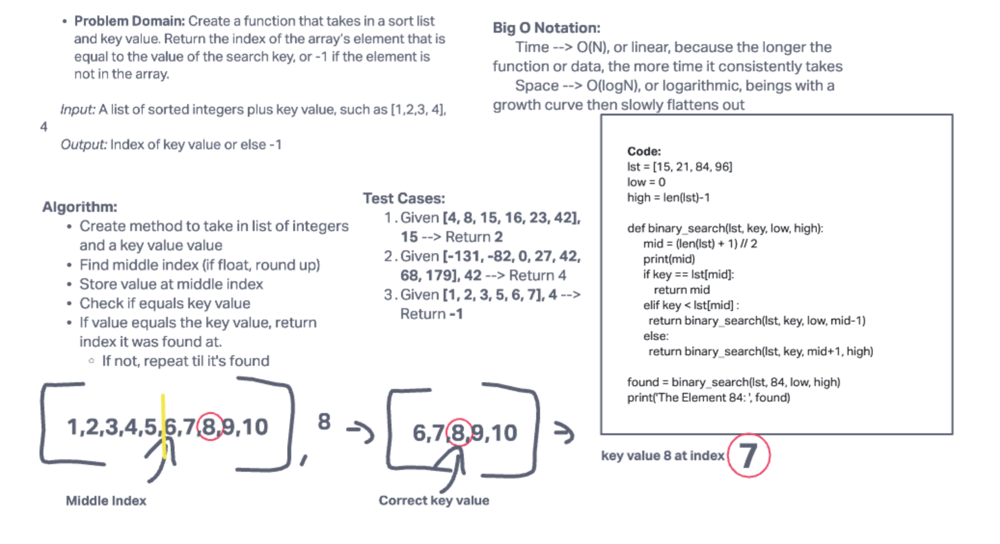

# Array Binary Search

Create a function that takes in a sort list and key value. Return the index of the array’s element that is equal to the value of the search key, or -1 if the element is not in the array.

___

___

## Approach

To solve this, I took the approach of using recursion. With this, the function binary_search finds the value at the middle index and if it matches the key value, return the index. If it is less than, repeat the process with the list values after it. If it is greater than, repeat the process with the list values before it. Repeat the processes until the key value is found and proper index is returned. 
