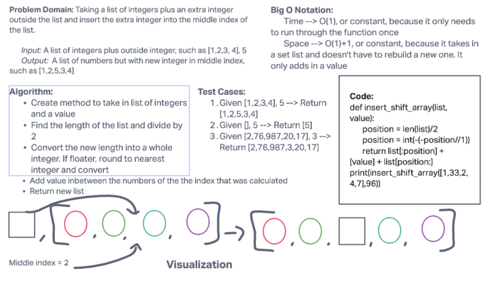

# Insert and Shift an Array

Write a function called **insertShiftArray** which takes in an array and a value to be added. Return an array with the new value added at the middle index.

___

## Approach

I knew I first had to take the length of whatever list is passed through. This would allow me to directly reference it once I was able to separate it into two parts. Then, since lists can consist of an amount of even or odd numbers, I used int() and float() functionality to make sure the index was rounded to the largest number then transformed into an integer. Finally, I could put whatever value at or after the middle index.

