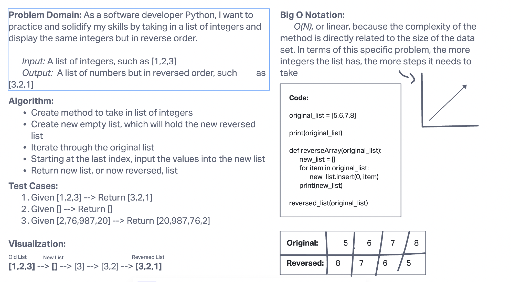

# Reverse An Array

Write a function named
**reverseArray** which takes an array as an argument. Without utilizing any of the built-in methods available to your language, return an array with elements in reversed order.

___

## Approach

To solve this problem, I utilized a method which integrated a simple for loop. The method took in an original list then created a new list which the values from the original list were inserted in but in reverse using the index.
