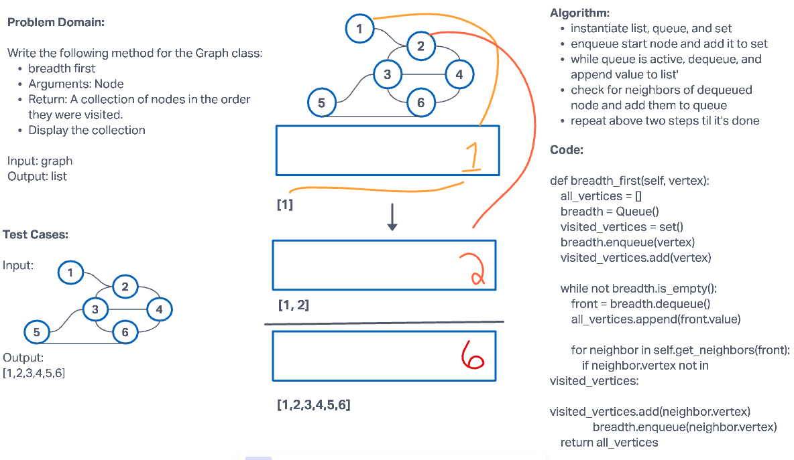

# Challenge Summary

Write the following method for the Graph class:

breadth first
Arguments: Node
Return: A collection of nodes in the order they were visited.
Display the collection

## Whiteboard Process


## Approach & Efficiency

For this challenge, utilized lists, queues, and sets. First, enqueued everything into a queue than dequeued and appended to a list.
The Big O Notation for this challenge is O(N) for both time and space.

## Solution

```python
pip install -r requirements.txt
pytest -k test_graph_breadth_first.py
```
