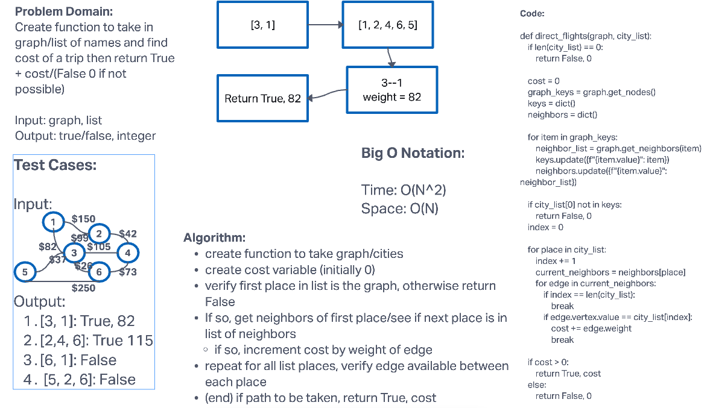

# Challenge Summary

- Write a function called business trip
- Arguments: graph, array of city names
- Return: the cost of the trip (if it’s possible) or null (if not)

Determine whether the trip is possible with direct flights, and how much it would cost.

## Whiteboard Process


## Approach & Efficiency

For this challenge, first verified any matches within list and graph. Then checked neighbors and then incremented cost by edge's weight. However, if any of these steps were not verified, it returned false.
The Big O Notation for this challenge is O(N^2) for time and O(N) for space.

## Solution

```python
pip install -r requirements.txt
pytest -k test_graph_business_trip.py
```
