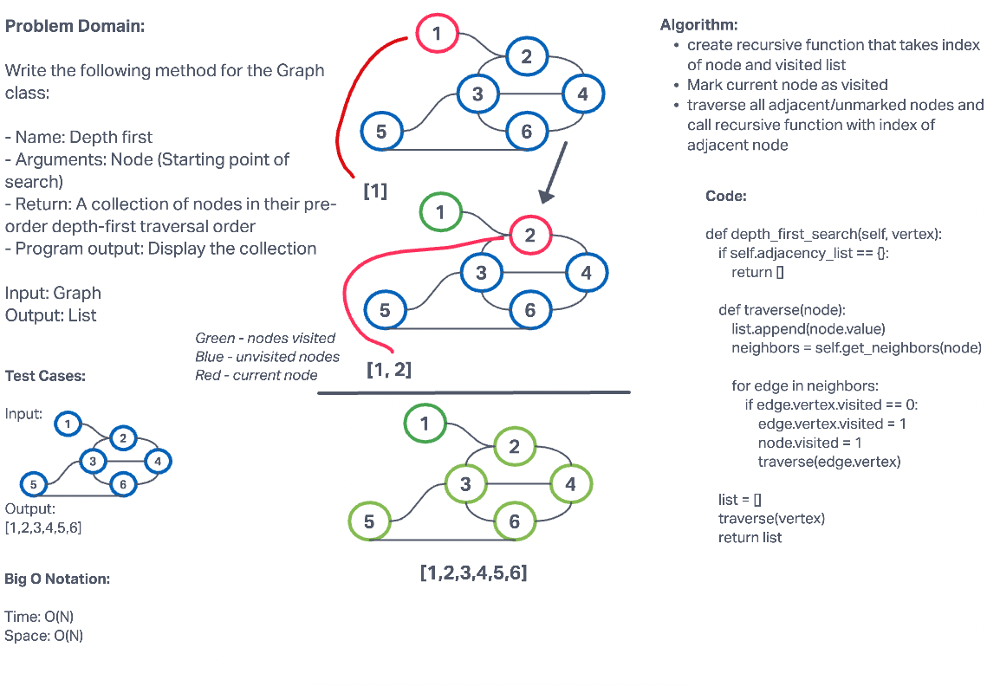

# Challenge Summary

Write the following method for the Graph class:

- Name: Depth first
- Arguments: Node (Starting point of search)
- Return: A collection of nodes in their pre-order depth-first traversal order
- Program output: Display the collection

## Whiteboard Process


## Approach & Efficiency

This challenge's code uses a recursive method that takes the index of the node and list. It recurses through the nodes, marking some as visited, unvisited, and current. 
The Big O Notation for this challenge is O(N) for both time and space.

## Solution

```python
pip install -r requirements.txt
pytest -k test_graph_depth_first.py
```
