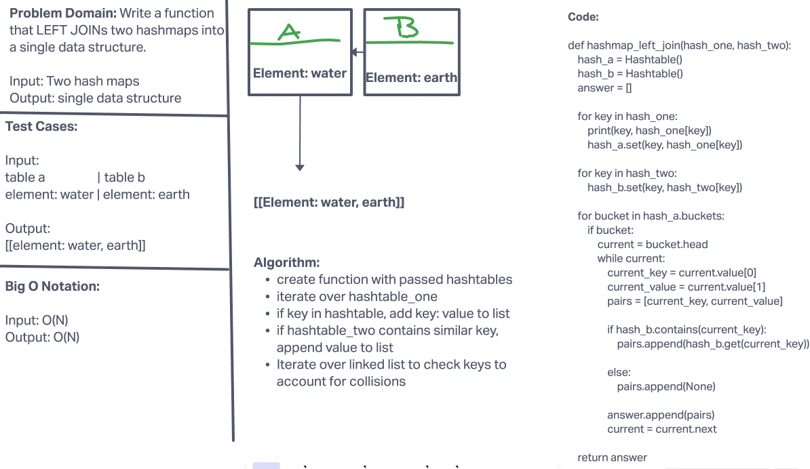

# Challenge Summary

Write a function that LEFT JOINs two hashmaps into a single data structure.

- Write a function called left join
- Arguments: two hash maps
  - The first parameter is a hashmap that has word strings as keys, and a synonym of the key as values.
  - The second parameter is a hashmap that has word strings as keys, and antonyms of the key as values.

- Return: The returned data structure that holds the results is up to you. It doesn’t need to exactly match the output below, so long as it achieves the LEFT JOIN logic


## Whiteboard Process


## Approach & Efficiency
For this challenge, the values from the second hashtable was added into the first hashtable. Same values were appended and then everything was ultimately returned into one list. 
Big O Notation for this challenge is O(N) for both time and space.

<!-- What approach did you take? Why? What is the Big O space/time for this approach? -->

## Solution

```python

pip install -r requirements.txt
pytest -k test_hashtable_left_join.py

```
