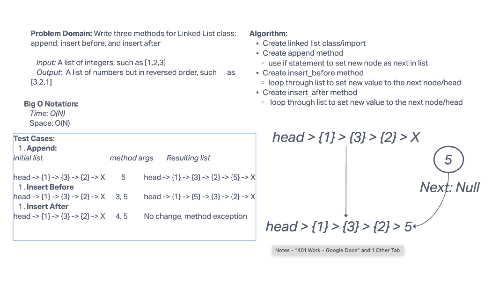

# Challenge Summary

Write three methods for Linked List Class: append, insert before, and insert after

## Whiteboard Process



## Approach & Efficiency

The Big O Notation for this challenge is O(N).

## Solution

```python

pytest -k test_linked_list_insertions.py

```
