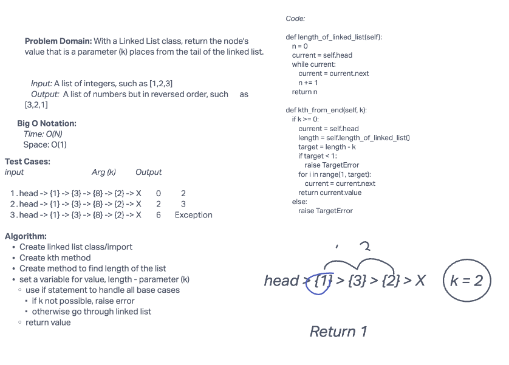

# Challenge Summary

With a Linked List class, return the node's value that is a parameter (k) places from the tail of the linked list.

## Whiteboard Process



## Approach & Efficiency

For this challenge, the Big O notation time is O(N) and space is O(1).

## Solution

```python

pytest -k test_linked_list_kth.py

```
