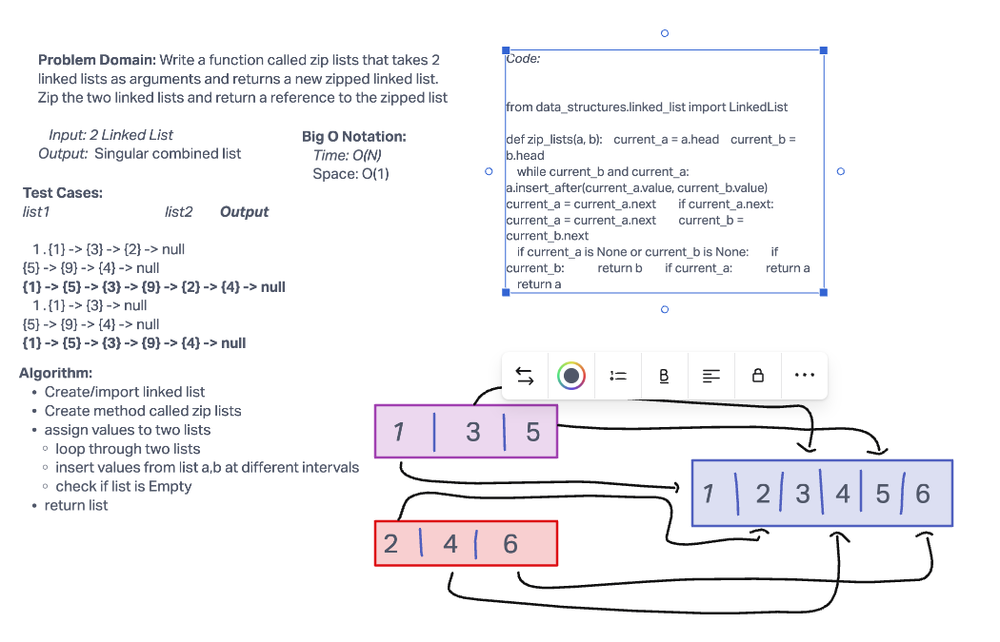

# Challenge Summary

Write a function called zip lists that takes 2 linked lists as arguments and returns a new zipped list. Zip the two linked lists and return a reference to the zipped list.

## Whiteboard Process



## Approach & Efficiency

The Big O Notation for this chalenge is O(N) for time and space is O(1).

## Solution

```python

pytest -k test_linked_list_zip.py

```
