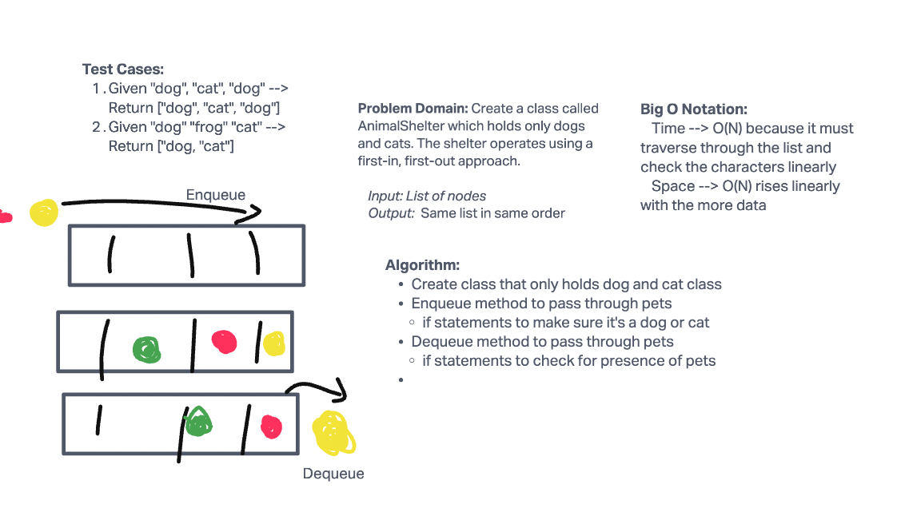

# Challenge Summary

Create a class called AnimalShelter which holds only dogs and cats. The shelter operates using a first-in, first-out approach.
Implement the following methods:
- enqueue
- Arguments: animal
  (animal can be either a dog or a cat object)
- dequeue
- Arguments: pref
  (pref can be either "dog" or "cat")
- Return: either a dog or a cat, based on preference.
- If pref is not "dog" or "cat" then return null.

## Whiteboard Process


## Approach & Efficiency

Big O Notation are O(N); it rises linearly in correlation with the amount of data.

## Solution

```python

pytest -k test_stack_queue_animal_shelter.py

```
