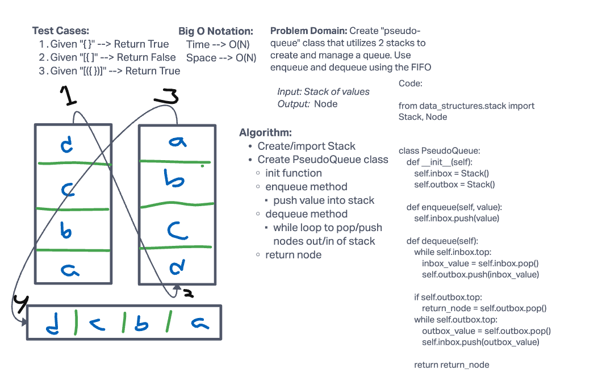

# Challenge Summary

Create "pseudo-queue" class that utilizes two stacks to create and manage a queue. Use enqueue and dequeue using "first in first out"

## Whiteboard Process



## Approach & Efficiency

The Big O Notation for this challenge is O(N).

## Solution

```python

pytest -k test_stack_queue_pseudo.py

```
