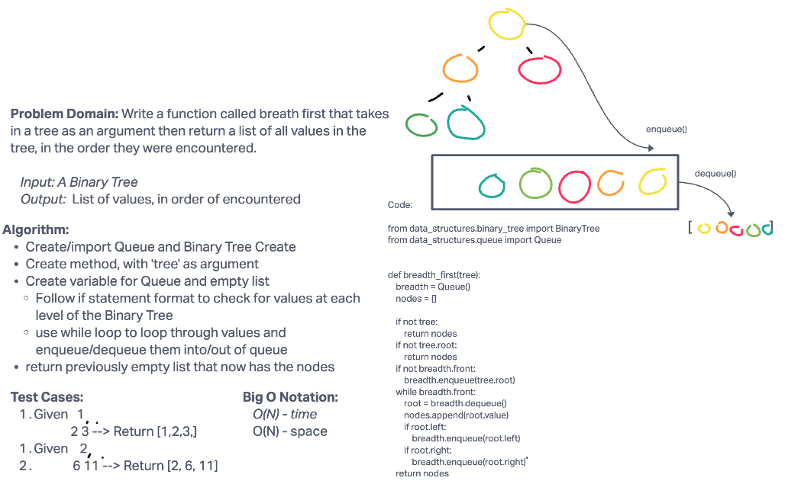

# Challenge Summary

- Write a function called breadth first
- Arguments: tree
- Return: list of all values in the tree, in the order they were encountered

## Whiteboard Process



## Approach & Efficiency

The Big O for both time and space for this challenge was O(N), meaning it rises linearly the more data there is within the tree. Took a breadth traversal approach by also utilizing a queue. Essentially, traversed through the binary tree while breadth traversal then enqueued and dequeued from a queue into a list to return the values. 

## Solution

```python

pytest -k test_breadth_first.py

```
