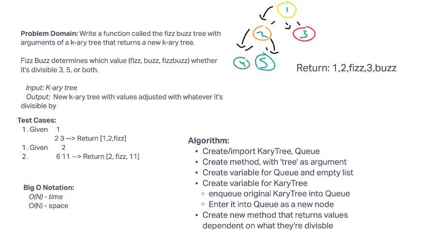

# Challenge Summary

Write a function called the fizz buzz tree with arguments of a k-ary tree that returns a new k-ary tree.

Fizz Buzz determines which value (fizz, buzz, fizzbuzz) whether it's divisible 3, 5, or both.

## Whiteboard Process



## Approach & Efficiency

The Big O Time and Space for this challenge is O(N).

## Solution

```python

pytest -k test_fizz_buzz.py

```
