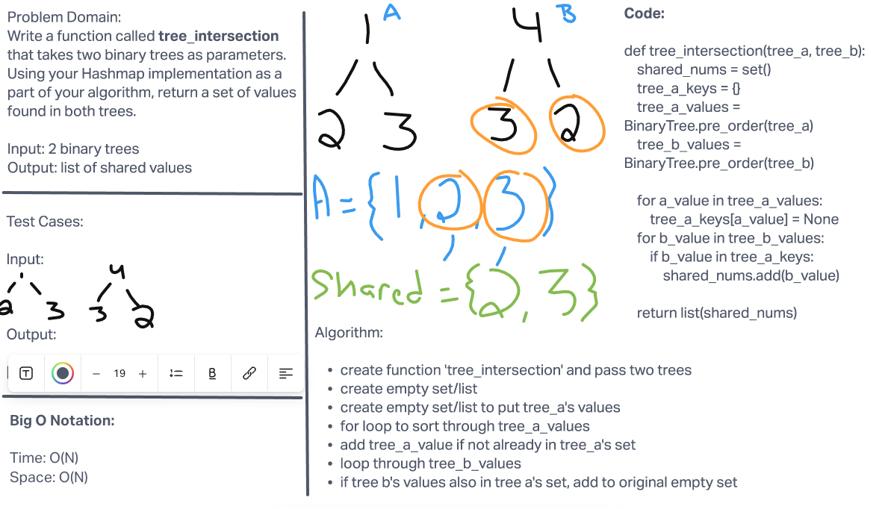

# Challenge Summary
Write a function called `tree_intersection` that takes two binary trees as parameters.
Using your Hashmap implementation as a part of your algorithm, return a set of values found in both trees.

## Whiteboard Process


## Approach & Efficiency
For this challenge, took the approach of putting one tree's values within a set and then iterating through the second tree's values. If the second tree has the same values within the first tree's set, put it in a new set and return that new set.
Big O notation for this challenge is O(N) for both space and time.

## Solution

```python

pip install -r requirements.txt
pytest -k test_hashtable_repeated-word.py

```
