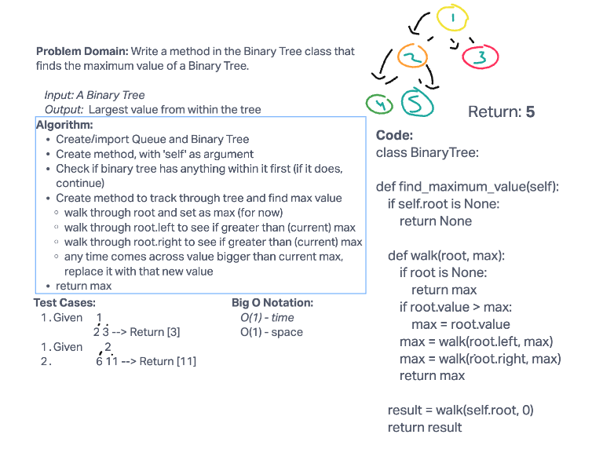

# Challenge Summary

Write a method in the Binary Tree class that finds the maximum value of a Binary Tree.

## Whiteboard Process


## Approach & Efficiency

The Big O for this challenge is O(1), following a constant trend.

## Solution

```python

source .venv/bin/Activate
pytest -k test_tree_max.py

```
